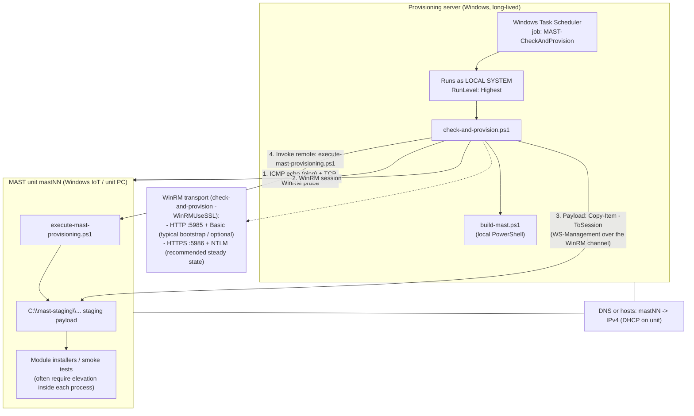
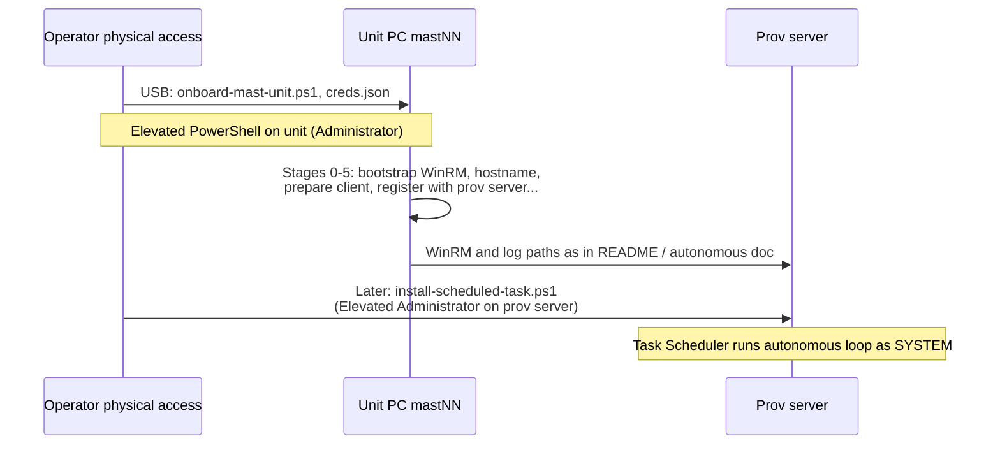

# MAST provisioning flow (diagrams)

Graphical view of which machine runs what, typical privilege levels, and protocols. For narrative detail see [README.md](../README.md) and [autonomous-provisioning.md](../autonomous-provisioning.md).

---

## Production steady state (after onboarding)



**Elevation (steady state)**

| Location | Typical identity / elevation |
|----------|-------------------------------|
| Provisioning server | Scheduled task runs as **LOCAL SYSTEM**, **RunLevel Highest** (`server/install-scheduled-task.ps1`). Design docs describe a possible future **non-elevated service account** for least privilege. |
| Unit | Remote commands run as the WinRM account from `vault/creds.json` (for example `.\mast`). Module installers may elevate per process / UAC as needed. |

**Protocols (steady state)**

| Protocol | Role |
|----------|------|
| ICMP | Reachability (ping-style checks before work). |
| DNS (or static hosts in dev) | Resolve hostname `mastNN`; units use DHCP. |
| WinRM TCP **5985** (HTTP, Basic) | Optional / bootstrap; used when not passing `-WinRMUseSSL`. |
| WinRM TCP **5986** (HTTPS, NTLM) | Recommended steady state when `-WinRMUseSSL` is used. |
| WS-Management | Control plane and **`Copy-Item -ToSession`** payload transfer share the WinRM session. |

---

## One-time onboarding (operator + unit)



Onboarding still centers on **WinRM** for remote control and related automation described in the repo.

---

## Dev/test loop (Windows host + VirtualBox VM)

```mermaid
flowchart LR
  subgraph HOST["Developer Windows host"]
    PY["run-prov-test.py<br/>(normal user)"]
    PSBUILD["build-mast.ps1 subprocess<br/>(local, no WinRM)"]
    HTTP["Embedded HTTP file server<br/>(transfer staging to VM)"]
    PY --> PSBUILD
    PY --> HTTP
  end

  subgraph VM["mast-unit VM"]
    WINRM["WinRM listener :5985 HTTP Basic"]
    RUN["Remote scripts via pywinrm"]
    HTTP -->|"HTTP GET files (staging payload)"| VM
    PY -->|"WinRM run_ps / SOAP over HTTP :5985"| WINRM --> RUN
  end

  SYNC["sync-dev-unit-hosts.ps1<br/>Elevated: edits SYSTEM hosts file"]
  ADM["admin-prep.ps1<br/>Elevated once: PATH, firewall ICMP"]
```

**Elevation (dev)**

| Component | Elevation |
|-----------|-----------|
| `admin-prep.ps1` | **Administrator** (machine PATH, firewall, ICMP). |
| `sync-dev-unit-hosts.ps1` | **Administrator** (edits `%SystemRoot%\System32\drivers\etc\hosts`). |
| `run-prov-test.py` | Usually **non-elevated**; uses **pywinrm** (no TrustedHosts admin dependency on the host). |
| `build-mast.ps1` (spawned locally) | Same as the shell user; no WinRM to the prov server VM for the build itself. |

**Protocols (dev)**

| Protocol | Role |
|----------|------|
| WinRM **5985** | Remote execution via **pywinrm**. |
| HTTP (ephemeral on host) | Staging file transfer from host to VM (`run-prov-test.py`). |
| ICMP | Optional; may be opened by `admin-prep.ps1`. |

---

## Optional / alternate transfer (design and build flags)

`autonomous-provisioning.md` discusses **unit pull** via **SMB** or **HTTP** from the provisioning server for large payloads. **`check-and-provision.ps1` currently uses WinRM `Copy-Item -ToSession`.** `build/build-mast.ps1` can create an **SMB share** when not using `-SkipSmbShare`.
